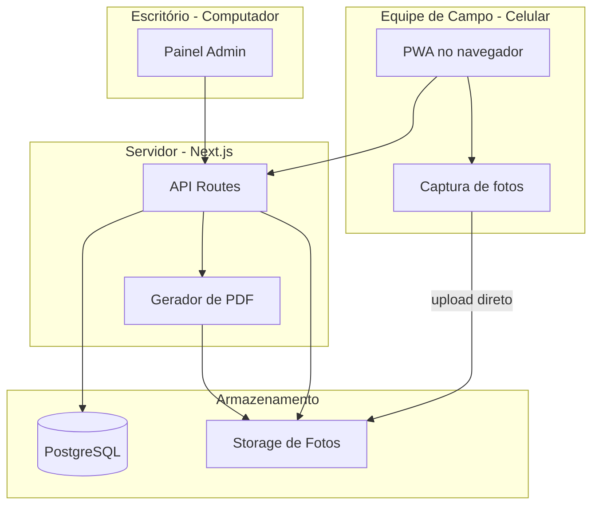
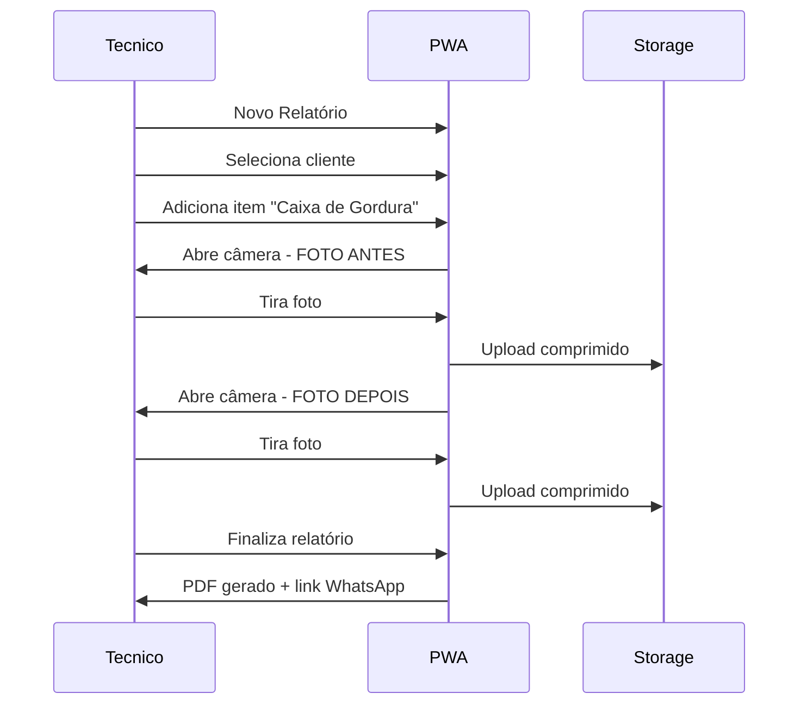

# App de Relatórios e Orçamentos — Empresa de Desentupimento

## Recomendação principal: Web App (PWA), não app nativo

Para o seu caso (equipe de campo + escritório, internet geralmente disponível), **um web app instalável (PWA) é a melhor escolha**:

| Critério | PWA (Next.js) | App nativo (React Native / Flutter) |
|---|---|---|
| Celular + computador | Um só código, funciona nos dois | Precisa manter 2+ plataformas |
| Câmera sem salvar na galeria | Sim — captura direto no navegador | Sim |
| Instalar na tela inicial | Sim (ícone como app) | Sim (loja de apps) |
| Custo de manutenção | Baixo | Alto |
| Atualizações | Instantâneas (deploy) | Precisa publicar na loja |

**App nativo só valeria a pena** se offline fosse essencial ou se precisasse de recursos muito avançados da câmera/GPS. Como você indicou que geralmente há internet, PWA resolve bem.

---

## Stack recomendada: Next.js + TypeScript (não Python como frontend)

**Use Next.js + TypeScript** como base do projeto inteiro:

- **Frontend**: React (telas mobile-first para técnicos, layout desktop para o escritório)
- **Backend/API**: rotas API do próprio Next.js (`app/api/...`)
- **Banco de dados**: PostgreSQL via [Supabase](https://supabase.com) ou [Neon](https://neon.tech) — gratuito para começar
- **Fotos**: Supabase Storage ou Cloudflare R2 (barato, escala bem)
- **PDF**: `@react-pdf/renderer` ou `puppeteer` no servidor para gerar relatório e orçamento em PDF
- **Auth**: Supabase Auth ou NextAuth — login por e-mail para técnicos e admin

**Python (FastAPI/Django)** faria sentido só como serviço separado se no futuro precisar de processamento pesado de imagem/IA. Para o MVP, adiciona complexidade sem ganho real.



---

## Papéis de usuário

Com base na sua resposta (equipe + escritório):

- **Técnico (campo)**: cria relatório no local, tira fotos, assina, envia
- **Admin (escritório)**: cadastra clientes, preços, vê todos os relatórios, gera orçamentos, exporta PDFs, gerencia usuários

---

## Estrutura do Relatório de Serviço

### Cabeçalho (dados fixos da empresa do seu pai)
- Razão social, CNPJ, endereço, telefone, e-mail, logo
- Configurado uma vez no painel admin — aparece automaticamente em todo relatório

### Dados do serviço
- Número do relatório (automático, sequencial)
- Data e hora de início/fim
- Endereço do serviço (com opção de usar GPS do celular)
- Técnico responsável

### Empresa/Pessoa contratante
- Nome/Razão social, CPF/CNPJ, telefone, e-mail, endereço
- Pode selecionar cliente já cadastrado ou criar novo na hora

### Itens de serviço (o coração do app)

Cada serviço realizado vira um **item** com fotos antes/depois:

```
Relatório #0042
├── Item 1: Limpeza de Caixa de Gordura
│   ├── Foto ANTES (vertical) 📷
│   ├── Foto DEPOIS (vertical) 📷
│   └── Observações: "Removidos 80L de resíduo"
├── Item 2: Desentupimento de Ralo
│   ├── Foto ANTES (horizontal) 📷
│   ├── Foto DEPOIS (horizontal) 📷
│   └── Observações: ""
└── Item 3: Sucção de Fossa
    ├── Foto ANTES (vertical) 📷
    ├── Foto DEPOIS (vertical) 📷
    └── Observações: "Fossa com 3m de profundidade"
```

### Catálogo de serviços pré-cadastrados
Tipos com orientação de foto sugerida:

| Serviço | Orientação sugerida |
|---|---|
| Caixa de gordura | Vertical |
| Fossa séptica | Vertical |
| Caixa de sabão | Vertical |
| Ralo / pia | Horizontal |
| Jateamento de tubulação | Horizontal |
| Sucção | Vertical |
| Desentupimento geral | Horizontal |

O admin define isso no catálogo; o técnico só seleciona o tipo e o app já pede a orientação certa.

### Rodapé do relatório
- Observações gerais
- Assinatura digital do técnico (desenhar na tela)
- Assinatura do cliente (opcional, na tela do celular)
- Botão: **Gerar PDF** e **Enviar por WhatsApp/E-mail**

---

## Fotos: como resolver o maior desafio

### Captura direta, sem galeria
No navegador mobile, usar a API de câmera (`navigator.mediaDevices.getUserMedia`) ou `<input capture="environment">`:
- A foto vai **direto para o app**, não para a galeria do celular
- Compressão automática no cliente (reduz de ~5MB para ~500KB) antes do upload
- Upload imediato para o storage na nuvem

### Orientação horizontal/vertical
- Ao adicionar um item de serviço, o app mostra um **guia visual** (moldura na orientação correta)
- Overlay na câmera: "Segure o celular na vertical" com ícone ilustrativo
- Validação leve: se a foto vier na orientação errada, aviso amigável (sem bloquear)

### Fluxo do técnico no campo


---

## Módulo de Orçamento Automático

Estrutura paralela ao relatório, mas focada em **preço antes do serviço**:

- Seleciona cliente
- Adiciona itens do catálogo com quantidade
- Cada item tem preço unitário (cadastrado no admin)
- Cálculo automático: subtotal, desconto (%), total
- Condições: forma de pagamento, validade do orçamento (ex: 15 dias)
- Gera PDF profissional com logo e dados da empresa
- Envia por WhatsApp/e-mail para o cliente aprovar

**Diferença chave**: orçamento não tem fotos; relatório tem fotos antes/depois.

---

## Telas principais do app

### Mobile (técnico)
1. **Home** — "Novo Relatório" / "Novo Orçamento" / "Meus Relatórios"
2. **Novo Relatório** — passo a passo (wizard): cliente → itens → fotos → revisão → enviar
3. **Câmera** — tela fullscreen com guia de orientação
4. **Revisão** — preview do relatório antes de gerar PDF

### Desktop (escritório/admin)
1. **Dashboard** — relatórios recentes, orçamentos pendentes
2. **Clientes** — CRUD de clientes
3. **Catálogo de Serviços** — tipos, preços, orientação de foto
4. **Relatórios** — lista com filtros, download PDF
5. **Orçamentos** — lista, status (pendente/aprovado/recusado)
6. **Configurações** — dados da empresa, logo, usuários

---

## Modelo de dados (simplificado)

```
empresa (dados fixos do pai)
clientes
usuarios (tecnico | admin)
catalogo_servicos (nome, preco, orientacao_foto)
orcamentos → orcamento_itens
relatorios → relatorio_itens → fotos (tipo: antes|depois, url, orientacao)
```

---

## Fases de desenvolvimento sugeridas

### Fase 1 — MVP (4-6 semanas)
- Auth (login técnico/admin)
- Cadastro de empresa e clientes
- Criar relatório com itens e fotos antes/depois
- Captura de câmera mobile com orientação
- Gerar PDF do relatório
- Painel admin básico

### Fase 2 — Orçamentos
- Catálogo de serviços com preços
- Criar orçamento automático
- PDF de orçamento
- Envio por WhatsApp (link do PDF)

### Fase 3 — Polimento
- Assinatura digital na tela
- Dashboard com métricas
- Busca e filtros avançados
- PWA instalável (ícone na tela inicial)
- Notificações (orçamento aprovado, etc.)

---

## Custos estimados para rodar

| Serviço | Custo inicial |
|---|---|
| Hospedagem (Vercel) | Grátis |
| Banco (Supabase) | Grátis até ~500MB |
| Storage de fotos | ~R$5-20/mês conforme uso |
| Domínio (.com.br) | ~R$40/ano |
| **Total inicial** | **~R$0-50/mês** |

---

## Estrutura de pastas do projeto

```
relatorio/
├── app/
│   ├── (auth)/login/
│   ├── (field)/          # telas mobile - técnico
│   │   ├── relatorio/novo/
│   │   └── camera/
│   ├── (admin)/          # telas desktop - escritório
│   │   ├── dashboard/
│   │   ├── clientes/
│   │   ├── relatorios/
│   │   └── orcamentos/
│   └── api/
│       ├── relatorios/
│       ├── orcamentos/
│       └── upload/
├── components/
│   ├── camera/           # captura de fotos
│   ├── pdf/              # templates PDF
│   └── ui/
├── lib/
│   ├── db.ts             # Prisma + PostgreSQL
│   └── storage.ts        # upload de fotos
└── prisma/
    └── schema.prisma
```

---

## Decisões técnicas finais

| Decisão | Escolha | Motivo |
|---|---|---|
| Tipo de app | PWA (web) | Um código, celular + PC, câmera funciona |
| Linguagem | TypeScript | Tipagem, ecossistema React, menos bugs |
| Framework | Next.js 15 (App Router) | Full-stack, SSR, API routes, deploy fácil |
| Banco | PostgreSQL + Prisma | Relacional, ideal para relatórios estruturados |
| Fotos | Supabase Storage | Integrado, barato, URLs públicas para PDF |
| PDF | @react-pdf/renderer | Gera no servidor, sem dependência externa |
| Deploy | Vercel | Grátis, deploy automático do GitHub |
